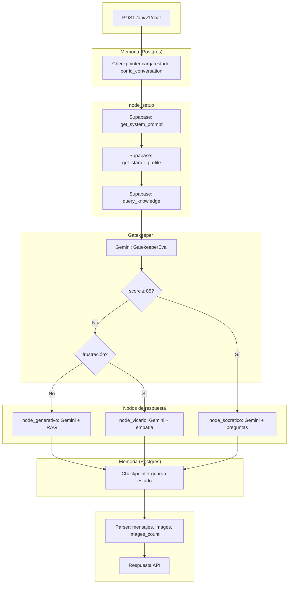

# Flujo del agente BIEX y uso de herramientas

Diagrama de la lógica del agente y dónde se usa cada herramienta en el flujo definido.

---

## Diagrama (flujo completo)

```
┌─────────────────────────────────────────────────────────────────────────────┐
│                         POST /api/v1/chat                                    │
│  Body: mensaje, id_conversation, id_user, tipo_respuesta, stream              │
└─────────────────────────────────────────────────────────────────────────────┘
                                      │
                                      ▼
┌─────────────────────────────────────────────────────────────────────────────┐
│  HERRAMIENTA: Postgres (si DATABASE_URL)                                     │
│  Checkpointer carga estado previo por thread_id = id_conversation             │
│  → Mensajes anteriores de la conversación                                    │
└─────────────────────────────────────────────────────────────────────────────┘
                                      │
                                      ▼
┌─────────────────────────────────────────────────────────────────────────────┐
│  NODO: node_setup (entry)                                                    │
│  ┌─────────────────────────────────────────────────────────────────────┐   │
│  │  HERRAMIENTA: Supabase                                                │   │
│  │  • get_system_prompt()     → system_prompt (str)                      │   │
│  │  • get_starter_profile(id_user) → perfil alumno (edad, intereses, etc.)│   │
│  │  • query_knowledge(mensaje) → rag_context (búsqueda semántica)       │   │
│  └─────────────────────────────────────────────────────────────────────┘   │
│  State: starter_profile, system_prompt, rag_context                          │
└─────────────────────────────────────────────────────────────────────────────┘
                                      │
                                      ▼
┌─────────────────────────────────────────────────────────────────────────────┐
│  GATEKEEPER: evaluate_gatekeeper                                            │
│  ┌─────────────────────────────────────────────────────────────────────┐   │
│  │  HERRAMIENTA: Gemini (LLM) + with_structured_output(GatekeeperEval)│   │
│  │  Entrada: último mensaje del alumno                                  │   │
│  │  Salida: comprension_score (0-100), frustracion_detectada (bool)    │   │
│  └─────────────────────────────────────────────────────────────────────┘   │
│  Reglas: score ≥ 85 → socrático | frustración → vicario | resto → generativo │
└─────────────────────────────────────────────────────────────────────────────┘
                                      │
                    ┌─────────────────┼─────────────────┐
                    ▼                 ▼                 ▼
        ┌───────────────┐ ┌───────────────┐ ┌───────────────┐
        │ node_         │ │ node_         │ │ node_         │
        │ generativo    │ │ vicario       │ │ socratico     │
        ├───────────────┤ ├───────────────┤ ├───────────────┤
        │ HERRAMIENTA:  │ │ HERRAMIENTA:  │ │ HERRAMIENTA:  │
        │ Gemini +      │ │ Gemini +      │ │ Gemini +      │
        │ system_prompt │ │ system_prompt │ │ system_prompt │
        │ + perfil      │ │ + perfil      │ │ + perfil      │
        │ + RAG context │ │ (sin RAG duro)│ │ (solo         │
        │               │ │ Empatía /     │ │ preguntas     │
        │ fase:         │ │ voz alta      │ │ críticas)     │
        │ generativa    │ │ fase: vicaria │ │ fase:         │
        │               │ │               │ │ socratica    │
        └───────┬───────┘ └───────┬───────┘ └───────┬───────┘
                │                 │                 │
                └─────────────────┼─────────────────┘
                                  ▼
┌─────────────────────────────────────────────────────────────────────────────┐
│  HERRAMIENTA: Postgres (si DATABASE_URL)                                     │
│  Checkpointer guarda nuevo estado (mensajes + fase) por thread_id            │
└─────────────────────────────────────────────────────────────────────────────┘
                                  │
                                  ▼
┌─────────────────────────────────────────────────────────────────────────────┐
│  Parser: parse_response_to_structured(texto_respuesta_AI)                    │
│  • Extrae URLs Minio (images)                                                │
│  • Limpia markdown, segmenta por \n\n → mensajes                             │
└─────────────────────────────────────────────────────────────────────────────┘
                                  │
                                  ▼
┌─────────────────────────────────────────────────────────────────────────────┐
│  Respuesta API: { mensajes, images, images_count, current_phase }            │
└─────────────────────────────────────────────────────────────────────────────┘
```

---

## Resumen por herramienta

| Herramienta | Dónde se usa | Qué hace en el flujo |
|-------------|--------------|----------------------|
| **Supabase** | `node_setup` | Prompt del sistema, perfil del alumno (`id_user`), contexto RAG del último `mensaje`. |
| **Gemini (LLM)** | Gatekeeper | Evalúa comprensión y frustración → decide generativo / vicario / socrático. |
| **Gemini (LLM)** | `node_generativo` | Respuesta educativa usando RAG + perfil. |
| **Gemini (LLM)** | `node_vicario` | Respuesta empática / en voz alta con perfil (sin RAG rígido). |
| **Gemini (LLM)** | `node_socratico` | Solo preguntas de pensamiento crítico. |
| **Postgres** | Antes y después del grafo | Carga/guarda estado por `id_conversation` (memoria de conversación). |
| **Parser** | Tras la respuesta AI | Convierte texto en `mensajes` + `images` + `images_count` para la API. |

---

## Versión Mermaid (para render en GitHub/GitLab)


