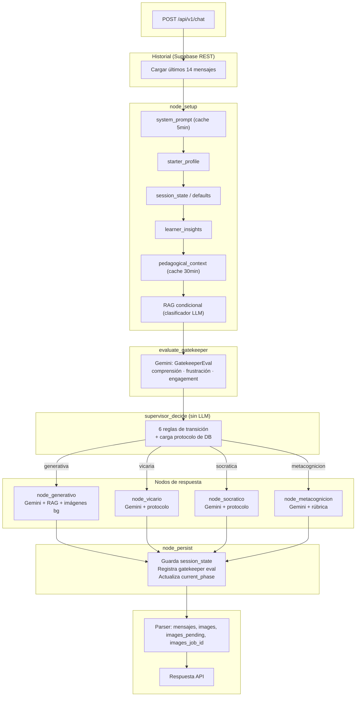

# Flujo del agente BIEX y uso de herramientas

Diagrama de la lógica del agente y dónde se usa cada herramienta en el flujo definido.

---

## Diagrama (flujo completo)

```
POST /api/v1/chat
    │  Body: mensaje, id_conversation, id_user, stream
    ▼
Cargar historial desde Supabase REST (últimos 14 mensajes + nuevo)
    │
    ▼
node_setup (paralelo):
  - system_prompt (cache TTL 5min)
  - starter_profile (perfil del alumno con todos los campos del form)
  - session_state (o crear defaults si es primera sesión)
  - learner_insights (observaciones de sesiones anteriores)
  - pedagogical_context (cache TTL 30min)
  - RAG condicional: clasificador LLM decide si buscar contenido
    │
    ▼
evaluate_gatekeeper (Gemini con protocolo de DB):
  - Evalúa: comprensión, frustración, engagement, misconceptions
  - Input: perfil + session_state + insights + últimos 5 mensajes
  - Output: GatekeeperEval (comprension_score, frustracion_nivel,
            engagement_score, misconceptions, recomendacion, justificacion)
    │
    ▼
supervisor_decide (determinístico, SIN LLM):
  - Lee session_state + gatekeeper_eval
  - Decide fase según 6 reglas de transición
  - Carga protocolo pedagógico de la DB para la fase decidida
  - Si hay recalibración, carga protocolo "recalibracion"
    │
    ├── generativa    (Gemini + protocolo + RAG + imágenes en background)
    ├── vicaria       (Gemini + protocolo, sin imágenes)
    ├── socratica     (Gemini + protocolo, sin imágenes)
    └── metacognicion (Gemini + protocolo + rúbrica)
              │
              ▼
node_persist:
  - Guarda session_state actualizado (upsert en Supabase)
  - Registra gatekeeper_evaluation (tabla analítica)
  - Actualiza conversations.current_phase
    │
    ▼
Parser: parse_response_to_structured
  - Extrae URLs Minio (images)
  - Limpia markdown, segmenta por \n\n → mensajes
    │
    ▼
Response: { mensajes, images, images_count, images_pending, images_job_id, current_phase }
```

---

## Resumen por herramienta

| Herramienta       | Dónde se usa              | Qué hace en el flujo                                                                                               |
| ----------------- | ------------------------- | ------------------------------------------------------------------------------------------------------------------ |
| **Supabase REST** | `node_setup`              | system_prompt, starter_profile, session_state, learner_insights, pedagogical_docs, protocolos (tabla `protocols`). |
| **Supabase REST** | `node_persist`            | Guarda session_state, registra gatekeeper_evaluation, actualiza conversations.current_phase.                       |
| **Gemini (LLM)**  | `evaluate_gatekeeper`     | Evalúa comprensión, frustración, engagement y misconceptions con salida estructurada (`GatekeeperEval`).           |
| **Gemini (LLM)**  | `should_query_rag`        | Clasificador con few-shot: decide si el mensaje requiere búsqueda RAG.                                             |
| **Gemini (LLM)**  | `node_generativo`         | Respuesta educativa usando perfil + protocolo + RAG.                                                               |
| **Gemini (LLM)**  | `node_vicario`            | Respuesta empática / pensamiento en voz alta.                                                                      |
| **Gemini (LLM)**  | `node_socratico`          | Preguntas de pensamiento crítico.                                                                                  |
| **Gemini (LLM)**  | `node_metacognicion`      | Cierre de sesión con reflexión metacognitiva y rúbrica.                                                            |
| **Gemini (LLM)**  | `_extract_image_topics`   | Extrae temas visuales de la respuesta (solo en fase generativa).                                                   |
| **Postgres**      | Antes y después del grafo | Carga/guarda historial de mensajes por `id_conversation` (checkpointer LangGraph).                                 |
| **Parser**        | Tras la respuesta AI      | Convierte texto en `mensajes` + `images` + `images_count` + `images_pending` + `images_job_id`.                    |

---

## Versión Mermaid (para render en GitHub/GitLab)


