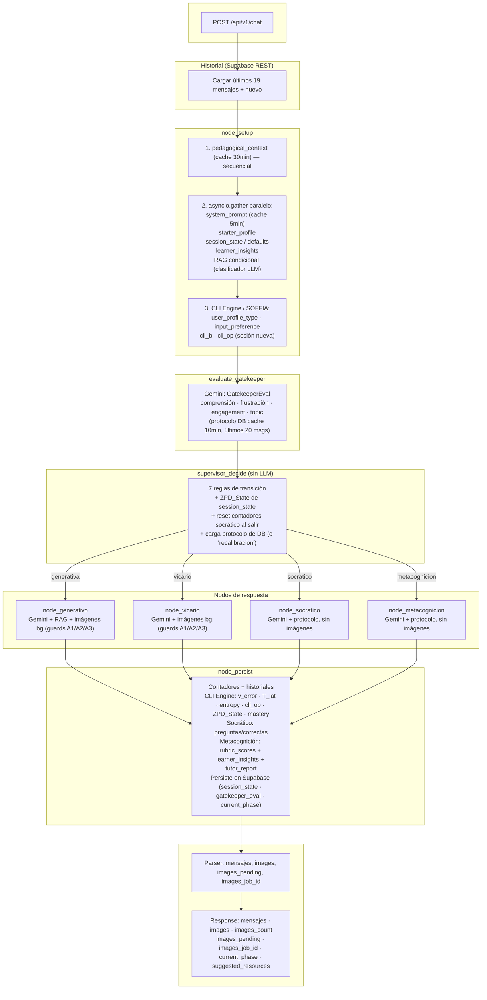

# Flujo del agente BIEX y uso de herramientas

Diagrama de la lógica del agente y dónde se usa cada herramienta en el flujo definido.

---

## Diagrama (flujo completo)

```
POST /api/v1/chat
    │  Body: mensaje, id_conversation, id_user, stream
    ▼
Cargar historial desde Supabase REST (últimos 19 mensajes + nuevo = 20)
    │  (main.py — el guardado lo maneja la Edge Function de Supabase, no este backend)
    ▼
node_setup:
  PASO 1 — secuencial:
  - pedagogical_context (cache TTL 30min)
  PASO 2 — asyncio.gather (paralelo):
  - system_prompt (cache TTL 5min)
  - starter_profile (perfil del alumno con todos los campos del form)
  - session_state (o crear defaults si es primera sesión)
  - learner_insights (observaciones de sesiones anteriores)
  - RAG condicional: clasificador LLM decide si buscar contenido educativo
  PASO 3 — síncrono post-gather (CLI Engine / SOFFIA):
  - Clasificar user_profile_type: EXPLORER (≤11 años) | ARCHITECT (12+)
  - Mapear input_preference: VISUAL | AUDIO | KINESTHETIC | LECTO_ANALYTIC
  - Calcular cli_b (carga cognitiva basal) si es sesión nueva
  - Inicializar cli_op = cli_b si es sesión nueva
  - Guardar user_profile_type e input_preference en session_state
    │
    ▼
evaluate_gatekeeper (Gemini con protocolo de DB, cache TTL 10min):
  - Input: perfil + session_state (fase, comprensión, frustración, topic actual,
            zdp_level, historial comp últimos 5, historial frust últimos 3)
            + insights + últimos 20 mensajes de la conversación
  - Output: GatekeeperEval (comprension_score, frustracion_nivel,
            engagement_score, misconceptions, recomendacion, justificacion,
            topic)
    │
    ▼
supervisor_decide (determinístico, SIN LLM):
  - Lee session_state (incluyendo zpd_state) + gatekeeper_eval
  - Decide fase según 7 reglas de transición (en orden de prioridad):
      0. Vicario + vicario_triggers >= 3     → generativa (recalibración, máxima prioridad)
      1. ZPD_State==PANIC o frust >= 6       → vicario (cualquier fase)
      2. Vicario + frust <= 3                → generativa
      3. Override manual (gatekeeper_override)→ socratico
      4. Generativa + promedio comp (últimos 3) >= 70 + interacciones >= 5 → socratico
      5a. Socratico + socratic_correct_answers >= 3 → metacognicion
      5b. Socratico + comp < 40 o frust >= 7 → generativa (recalibración)
      6. Metacognicion + rubric promedio < 50 → generativa (recalibración)
  - Carga protocolo pedagógico de la DB para la fase decidida
  - Si hay recalibración, carga protocolo "recalibracion" en su lugar
  - Al salir de socratico: resetea socratic_questions_answered y
    socratic_correct_answers a 0
  - Registra phase_transition en session_state si cambió de fase
    │
    ├── generativa    (Gemini + protocolo + RAG + imágenes en background)
    ├── vicario       (Gemini + protocolo + imágenes en background, mismos guards que generativa)
    ├── socratico     (Gemini + protocolo, sin imágenes)
    └── metacognicion (Gemini + protocolo, sin imágenes + rúbrica proxy generada en node_persist)

Guards de generación de imágenes (aplica a generativa y vicario):
  - Bypass si el alumno pidió imagen explícitamente en el mensaje
  - A1: Saltar si interaction_count < 1 o respuesta < 100 chars
  - A2: Saltar si la respuesta termina en '?' o tiene >= 2 '?' (respuesta es pregunta)
  - A3: Saltar si images_generated_count >= 1 (máximo 1 imagen por sesión)
  Máximo 2 temas visuales por respuesta (extraídos con LLM auxiliar)
              │
              ▼
node_persist:
  — Contadores y historiales —
  - Incrementa interaction_count
  - Actualiza last_interaction_time (UTC ISO)
  - Actualiza comprehension_history, frustration_history, engagement_history
    (mantiene últimos 20 valores en cada uno)
  - Acumula misconceptions (únicos, últimos 10)
  - Actualiza current_topic y topics_covered si el gatekeeper detectó topic
  - Incrementa vicario_triggers al estar en fase vicario

  — CLI Engine / SOFFIA —
  - Actualiza v_error (errores consecutivos):
      v_error++ si comprension < 40; v_error = 0 si comprension >= 60
  - Calcula T_latencia: ratio tiempo actual / baseline histórico de latencias
  - Calcula Action_Entropy: variabilidad de cambios de tema (0.0 = enfocado, 1.0 = saltando)
  - Recalcula cli_op según v_error, frustracion, T_latencia, Action_Entropy
  - Recalcula zdp_level: comp_avg(últimos 5) − frust_avg(últimos 5) × 10
  - Determina ZPD_State:
      PANIC    si v_error>=2 o frust>=6 o (T_lat>1.5 y frust>=4)
      BOREOUT  si engagement<30 o (T_lat<0.5 y entropy>0.5)
      FLOW     en cualquier otro caso
  - Actualiza mastery por tema (score 0.0–5.0):
      comp>=80 → +0.5 | comp>=60 → +0.2 | comp<40 → −0.3

  — Socrático —
  - Incrementa socratic_questions_answered y socratic_correct_answers
    si fase es socratico (correcto = comprension_score >= 60)

  — Metacognición —
  - Genera rubric_scores proxy (factual, aplicacion, analisis, sintesis)
    basado en comprensión y engagement del gatekeeper
  - Upserta learner_insights en Supabase:
      topic_mastery (por cada tema de los últimos 5 cubiertos)
      misconception (por cada misconception de los últimos 5)
      emotional_pattern (si vicario_triggers > 0)
  - Genera y guarda tutor_report en Supabase

  — Persistencia —
  - Guarda session_state actualizado (upsert en Supabase)
  - Registra gatekeeper_evaluation en tabla analítica (con scores 4D: CARE/KNOW/CONSTRUCT/DO)
  - Actualiza conversations.current_phase
    │
    ▼
Parser: parse_response_to_structured
  - Extrae URLs Minio (images, si el LLM las incluyó en el texto)
  - Limpia markdown y tags internos (REPORT_JSON, IMAGES{}, hallucinated tags)
  - Segmenta por \n\n → mensajes
    │
    ▼
Response: { mensajes, images, images_count, images_pending, images_job_id,
            current_phase, suggested_resources }

suggested_resources (generados en _invoke_with_images, evaluados por _detect_resource_suggestions):
  - "mind_map"  si topics_covered >= 5 y comp >= 75 y interaction_count >= 10
  - "fichas"    si interaction_count >= 14 y comp >= 65 y topics_covered >= 3
  - "video", "podcast", "informe" — exclusivamente en metacognicion
  - Nunca en vicario ni socratico; máximo 3 sugerencias
```

---

## Resumen por herramienta

| Herramienta        | Dónde se usa                   | Qué hace en el flujo                                                                                                                             |
| ------------------ | ------------------------------ | ------------------------------------------------------------------------------------------------------------------------------------------------ |
| **Supabase REST**  | `node_setup`                   | system_prompt, starter_profile, session_state, learner_insights, pedagogical_docs, protocolos, RAG (tabla `documents`).                         |
| **Supabase REST**  | `node_persist`                 | Guarda session_state, registra gatekeeper_evaluation (4D), actualiza conversations.current_phase. En metacognición: upserta learner_insights y tutor_report. |
| **Supabase REST**  | `evaluate_gatekeeper`          | Carga el protocolo del gatekeeper (cache TTL 10min).                                                                                            |
| **Gemini (LLM)**   | `evaluate_gatekeeper`          | Evalúa comprensión, frustración, engagement, misconceptions y topic con salida estructurada (`GatekeeperEval`).                                  |
| **Gemini (LLM)**   | `should_query_rag`             | Clasificador con few-shot + pre-filtro heurístico: decide si el mensaje requiere búsqueda RAG.                                                   |
| **Gemini (LLM)**   | `node_generativo`              | Respuesta educativa usando perfil + protocolo + RAG + SOFFIA context.                                                                            |
| **Gemini (LLM)**   | `node_vicario`                 | Respuesta empática / pensamiento en voz alta.                                                                                                    |
| **Gemini (LLM)**   | `node_socratico`               | Preguntas de pensamiento crítico.                                                                                                                |
| **Gemini (LLM)**   | `node_metacognicion`           | Cierre de sesión con reflexión metacognitiva.                                                                                                    |
| **Gemini (LLM)**   | `_extract_image_topics`        | Extrae temas visuales de la respuesta (solo en fases generativa y vicario, con guards A1/A2/A3).                                                 |
| **MemorySaver**    | Grafo LangGraph (in-process)   | Checkpointer en memoria por request. El estado real se lee y escribe desde Supabase (no Postgres externo).                                       |
| **Parser**         | Tras la respuesta AI           | Convierte texto en `mensajes` + `images` + `images_count` + `images_pending` + `images_job_id` + `suggested_resources`.                         |

---

## GatekeeperEval – campos de salida

| Campo                   | Tipo            | Descripción                                                                         |
| ----------------------- | --------------- | ----------------------------------------------------------------------------------- |
| `comprension_score`     | `float` (0-100) | Nivel de comprensión detectado en el mensaje                                        |
| `frustracion_detectada` | `bool`          | Si se detecta frustración                                                           |
| `frustracion_nivel`     | `int` (0-10)    | Intensidad de la frustración                                                        |
| `engagement_score`      | `float` (0-100) | Nivel de engagement del alumno                                                      |
| `misconceptions`        | `list[str]`     | Malentendidos conceptuales detectados                                               |
| `recomendacion`         | `str`           | `continuar`, `intensificar`, `simplificar`, `vicario`, `socratico`, `metacognicion` |
| `justificacion`         | `str`           | Breve justificación de los scores                                                   |
| `topic`                 | `str`           | Tema educativo principal del mensaje (vacío si saludo/sin tema)                     |

---

## Umbrales del Supervisor (SUPERVISOR_THRESHOLDS)

| Parámetro                        | Valor | Descripción                                                           |
| -------------------------------- | ----- | --------------------------------------------------------------------- |
| `comprension_para_socratico`     | 70    | Promedio mínimo de comprensión (últimos 3 scores) para pasar a socrático |
| `mensajes_para_promediar`        | 3     | Cantidad de últimos scores a promediar (Regla 4)                      |
| `interacciones_minimas_generativa`| 5   | Mínimo de interacciones antes de poder transicionar a socrático       |
| `frustracion_trigger_vicario`    | 6     | Nivel de frustración para activar vicario (Regla 1)                   |
| `frustracion_salida_vicario`     | 3     | Nivel de frustración para salir de vicario (Regla 2)                  |
| `vicario_max_triggers`           | 3     | Máximo de turnos en vicario antes de forzar recalibración (Regla 0)   |
| `socratico_correctas_para_meta`  | 3     | Respuestas correctas en socrático para avanzar a metacognición        |
| `socratico_comprension_correcta` | 60    | Score mínimo para contar respuesta socrática como correcta            |
| `comprension_recalibracion`      | 40    | Comprensión por debajo de esto en socrático → recalibrar              |
| `frustracion_recalibracion`      | 7     | Frustración por encima de esto en socrático → recalibrar              |
| `rubrica_minima_aprobacion`      | 50    | Promedio de rúbrica por debajo en metacognición → recalibrar          |

---

## ZPD_State – lógica de determinación

```
PANIC   si v_error >= 2
        o frustracion >= 6
        o (T_latencia > 1.5 y frustracion >= 4)

BOREOUT si engagement < 30
        o (T_latencia < 0.5 y action_entropy > 0.5)

FLOW    en cualquier otro caso
```

`ZPD_State` se determina en `node_persist` y se persiste en `session_state`.
El supervisor lo lee en la siguiente interacción para aplicar la Regla 1.

---

## CLI Engine (SOFFIA) – variables en session_state

| Variable              | Calculada en      | Descripción                                                           |
| --------------------- | ----------------- | --------------------------------------------------------------------- |
| `user_profile_type`   | `node_setup`      | `EXPLORER` (≤11 años) o `ARCHITECT` (12+)                            |
| `input_preference`    | `node_setup`      | `VISUAL`, `AUDIO`, `KINESTHETIC`, `LECTO_ANALYTIC`                   |
| `cli_b`               | `node_setup`      | Carga cognitiva basal (fijo por sesión nueva)                         |
| `cli_op`              | `node_persist`    | Carga cognitiva operativa (actualizada por turno)                     |
| `v_error`             | `node_persist`    | Errores consecutivos (++si comp<40, reset si comp>=60)                |
| `t_latencia`          | `node_persist`    | Ratio tiempo de respuesta vs baseline histórico                       |
| `t_latencia_history`  | `node_persist`    | Historial de latencias en segundos (últimas 20)                       |
| `action_entropy`      | `node_persist`    | Variabilidad de cambios de tema (0.0–1.0)                             |
| `topic_change_history`| `node_persist`    | Registro de cambios de tema (últimos 10)                              |
| `zpd_state`           | `node_persist`    | Estado ZPD: `FLOW`, `BOREOUT`, `PANIC`                               |
| `zdp_level`           | `node_persist`    | Nivel ZDP numérico: comp_avg − frust_avg×10 (0–100)                  |
| `mastery`             | `node_persist`    | Dict `{topic: score}` con nivel de dominio por tema (0.0–5.0)        |

---

## Versión Mermaid (para render en GitHub/GitLab)


